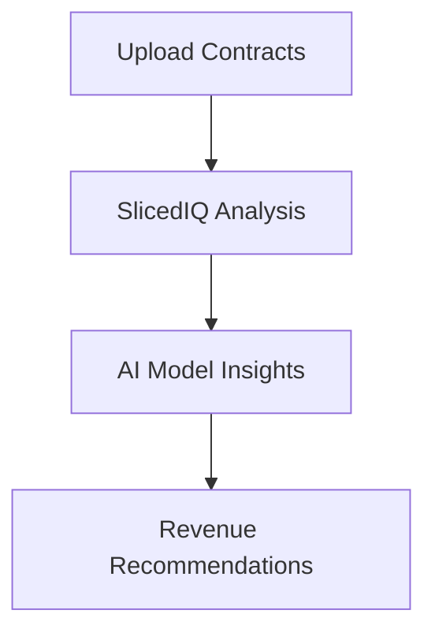

## Overview

SlicedHealth provides powerful tools to uncover hidden revenue opportunities, detect underpayments, and ensure compliance. You gain real-time insights through AI-driven analysis, dashboards, and reporting. Key features include SlicedIQ for intelligent modeling, contract variance detection, business intelligence, price transparency, and claim estimation.

<Callout kind="info">
These features work together to help you manage revenue cycles efficiently. Start with SlicedIQ for the most impact.
</Callout>

## Key Features

Explore the core capabilities organized visually below.

<Columns cols={3}>
  <Card title="SlicedIQ" icon="zap" href="#slicediq">
    AI-powered modeling and analysis for smarter revenue decisions.
  </Card>
  <Card title="Contract Variance" icon="alert-triangle" href="#variance">
    Real-time detection of underpayments and denials.
  </Card>
  <Card title="Business Intelligence" icon="bar-chart-3" href="#bi">
    Interactive dashboards for data-driven insights.
  </Card>
  <Card title="Price Transparency" icon="shield" href="#transparency">
    Compliance reporting to meet regulatory requirements.
  </Card>
  <Card title="Claim Estimation" icon="trending-up" href="#estimation">
    Predict and secure upfront payments accurately.
  </Card>
</Columns>

## SlicedIQ: AI Modeling and Analysis

SlicedIQ uses advanced AI to model revenue scenarios and identify optimization opportunities. You upload contract data, and the engine analyzes variances against expected payments.



Integrate via API for automated workflows.

<CodeGroup tabs="JavaScript,Python">
  ```javascript
  const response = await fetch('https://api.example.com/v1/slicediq/analyze', {
    method: 'POST',
    headers: { 'Authorization': 'Bearer YOUR_API_KEY' },
    body: JSON.stringify({ contractId: 'contract-123' })
  });
  const insights = await response.json();
  console.log(insights.revenueOpportunities);
  ```
  ```python
  import requests
  response = requests.post(
      'https://api.example.com/v1/slicediq/analyze',
      headers={'Authorization': 'Bearer YOUR_API_KEY'},
      json={'contractId': 'contract-123'}
  )
  insights = response.json()
  print(insights['revenueOpportunities'])
  ```
</CodeGroup>

## Contract Variance Detection

Monitor contracts in real-time to catch underpayments and denials instantly. Set thresholds to receive alerts when variances exceed `{10%}`.

<ParamField path="contractId" param-type="string" required="true">
  The unique identifier for the contract to analyze.
</ParamField>

<ParamField query="threshold" param-type="number" required="false">
  Variance threshold as a percentage, e.g., `5.0`.
</ParamField>

## Business Intelligence Dashboards

Access customizable dashboards to track key metrics like revenue recovery rates and denial trends. Filter data by payer or facility.

<Tabs>
  <Tab title="Dashboard Setup" icon="settings">
    Follow these steps to configure your first dashboard.

    <Steps>
      <Step title="Connect Data Source" icon="database">
        Link your billing system via API.
      </Step>
      <Step title="Select Metrics" icon="bar-chart">
        Choose KPIs like AR days and denial rates.
      </Step>
      <Step title="Share Dashboard" icon="users">
        Generate secure links for your team.
      </Step>
    </Steps>
  </Tab>
  <Tab title="Key Metrics" icon="trending-up">
    Common metrics include:

    | Metric              | Description                          |
    |---------------------|--------------------------------------|
    | Revenue Recovery    | Percentage of underpayments recovered |
    | Denial Rate         | Claims denied per month              |
    | AR Days             | Average days to receive payment      |
  </Tab>
</Tabs>

## Price Transparency Reporting

Generate compliant reports for price transparency mandates. Export machine-readable files for public posting.

<Callout kind="tip">
Run reports monthly to stay ahead of compliance deadlines.
</Callout>

## Claim Estimation Workflows

Estimate claim values upfront to enable faster payments. Input procedure codes and receive probabilistic forecasts.

<Expandable title="Advanced Estimation Options" default-open="false">
Use custom models trained on your historical data for `{95%}` accuracy.

```javascript
// Example: Custom model estimation
const estimate = await fetch('https://api.example.com/v1/claims/estimate', {
  method: 'POST',
  body: JSON.stringify({
    procedureCode: '99213',
    payerId: 'payer-456',
    customModel: true
  })
});
```
</Expandable>

## Next Steps

<Columns cols={2}>
  <Card title="Quickstart" icon="rocket" href="/quickstart">
    Set up your account and run your first analysis.
  </Card>
  <Card title="API Reference" icon="code" href="/authentication">
    Integrate features programmatically.
  </Card>
</Columns>