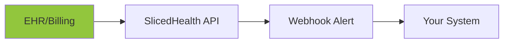

## Overview

SlicedHealth supports seamless integrations with EHR systems, billing software, and custom APIs to automate data exchange and real-time insights. Use these connections to sync claims data, receive denial alerts via webhooks, and import external datasets for comprehensive revenue analysis.

<Columns cols={3}>
  <Card title="API Access" icon="zap" href="#api-integrations">
    Direct REST API for claims, patients, and variance data.
  </Card>
  <Card title="Webhooks" icon="bell" href="#webhooks">
    Real-time notifications for underpayments and denials.
  </Card>
  <Card title="EHR Partners" icon="activity" href="#ehr-integrations">
    Pre-built connectors for Epic, Cerner, and more.
  </Card>
</Columns>

<Callout kind="tip">
  Start with your `{API_KEY}` from the dashboard to test connections. Review rate limits: `<1000` requests per hour.
</Callout>

## API Integrations

Access SlicedHealth data programmatically via REST endpoints at `https://api.example.com/v1`. Authenticate requests with Bearer tokens.

<ParamField path="claim_id" param-type="string" required="true">
  Unique claim identifier from your EHR.
</ParamField>

<ParamField header="Authorization" param-type="string" required="true">
  Bearer `{YOUR_TOKEN}`.
</ParamField>

<CodeGroup tabs="JavaScript,Python">
  ```javascript
  const response = await fetch('https://api.example.com/v1/claims/{claim_id}', {
    headers: {
      'Authorization': `Bearer ${YOUR_TOKEN}`,
      'Content-Type': 'application/json'
    }
  });
  const data = await response.json();
  console.log(data.variance_amount);
  ```
  ```python
  import requests
  headers = {
      'Authorization': f'Bearer {YOUR_TOKEN}',
      'Content-Type': 'application/json'
  }
  response = requests.get('https://api.example.com/v1/claims/{claim_id}', headers=headers)
  data = response.json()
  print(data['variance_amount'])
  ```
</CodeGroup>

<Response tabs="200,400">
  ```json
  {
    "claim_id": "clm_12345",
    "variance_amount": 150.25,
    "status": "underpaid"
  }
  ```
  ```json
  {
    "error": "Invalid claim_id",
    "code": 400
  }
  ```
</Response>

## Webhook Configurations

Set up webhooks to receive instant alerts for contract variances and denials. Configure in your dashboard under Settings > Integrations.

<Steps>
  <Step title="Create Webhook" icon="plus">
    Navigate to dashboard and select "New Webhook".
    
    Set URL: `https://your-webhook-url.com/slicedhealth`
  </Step>
  <Step title="Select Events" icon="bell">
    Choose events like `claim.denied` or `variance.detected`.
  </Step>
  <Step title="Test Connection" icon="play">
````bash
curl -X POST https://api.example.com/v1/webhooks/test \
  -H "Authorization: Bearer {YOUR_TOKEN}" \
  -d '{"url": "https://your-webhook-url.com"}'
````
  </Step>
  <Step title="Verify Payload" icon="check-circle">
    Handle incoming POST requests:
    
````javascript
app.post('/slicedhealth', (req, res) => {
  console.log(req.body.variance_amount); // e.g., 150.25
  res.status(200).send('OK');
});
````
  </Step>
</Steps>

## EHR and Billing Integrations

Connect with popular healthcare systems using pre-built integrations or FHIR standards.

<Tabs>
  <Tab title="Epic" icon="activity">
    Use FHIR API to sync patient claims.
    
    <ParamField query="fhir_version" param-type="string" default="4.0.1">
      FHIR specification version.
    </ParamField>
    
    Endpoint: `https://api.example.com/v1/integrations/epic/sync`
  </Tab>
  <Tab title="Cerner" icon="shield">
    OAuth 2.0 flow for billing data.
    
    Steps: Authorize > Exchange token > Poll claims.
  </Tab>
  <Tab title="Other (e.g., Athenahealth)" icon="database">
    Custom SFTP for batch imports.
  </Tab>
</Tabs>

## Data Import from External Sources

Import CSV or JSON files for custom analysis, such as historical claims or partner data.

<Expandable title="CSV Format Requirements" default-open="true">
  Required columns: `claim_id`, `amount_billed`, `amount_paid`, `date`.

  Example:
  
  ```csv
  claim_id,amount_billed,amount_paid,date
  clm_12345,1000.00,850.00,2024-01-15
  clm_67890,2000.00,1950.00,2024-01-16
  ```
</Expandable>

<Callout kind="alert">
  Max file size: `<10MB`. Encrypt sensitive data with AES-256.
</Callout>

## Next Steps

<Columns cols={2}>
  <Card title="Authentication" icon="lock" href="/authentication">
    Secure your API keys first.
  </Card>
  <Card title="Quickstart" icon="rocket" href="/quickstart">
    Run your first integration test.
  </Card>
</Columns>

